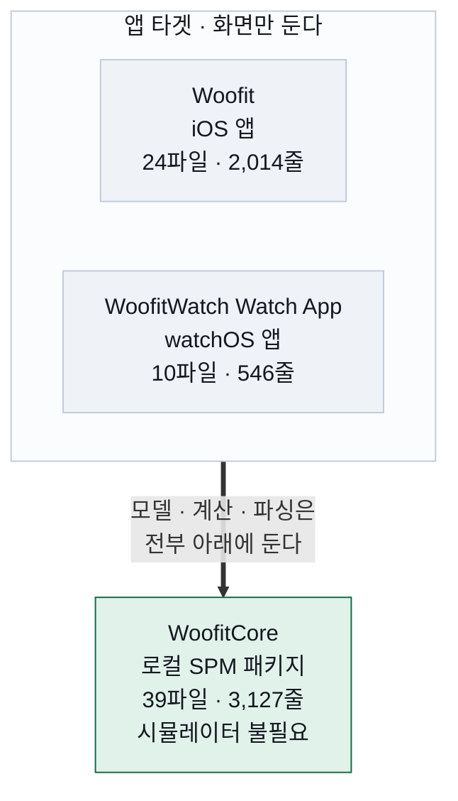
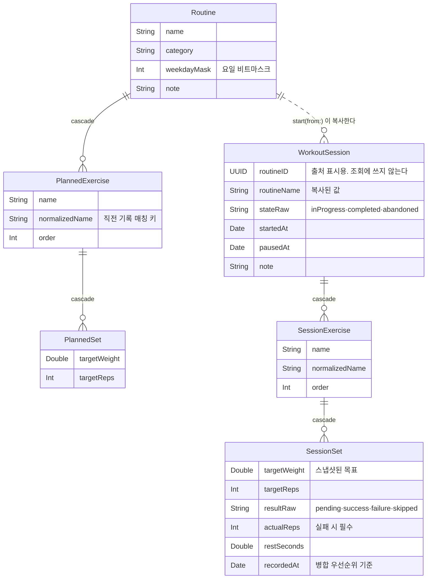
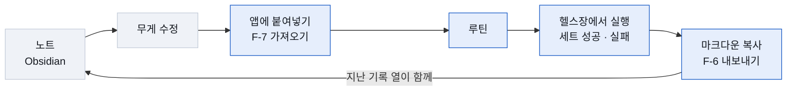

# Woofit 기술 명세

> **2026-08-30** · iOS 26 · watchOS 26
> 제품 정의는 [PRD](PRD.md) 가 맡고, 이 문서는 그것을 **어떻게 지었는지**를 다룬다.

근력 루틴을 미리 짜두고 헬스장에서 실행한 뒤 마크다운으로 뽑아 노트에 붙이는
개인용 iOS · watchOS 앱. 사용자 1인, 서버 없음, 오프라인 전용.

| 빌드 타겟 | SwiftData 모델 | 테스트 | 외부 의존성 | 전체 테스트 시간 |
| --- | --- | --- | --- | --- |
| 3 | 6 | 144 | 0 | 0.15초 |

---

## 목차

1. [아키텍처](#1-아키텍처)
2. [데이터 모델](#2-데이터-모델)
3. [불변식](#3-불변식)
4. [마크다운 왕복](#4-마크다운-왕복)
5. [폰 ↔ 워치](#5-폰--워치)
6. [테스트 전략](#6-테스트-전략)
7. [기술 선택](#7-기술-선택)
8. [빌드와 배포](#8-빌드와-배포)

---

## 1. 아키텍처

> 구조 전체가 **하나의 경계** 위에 서 있다. 도메인 로직은 전부 로컬 Swift Package
> `WoofitCore` 에 있고, 앱 타겟은 화면만 갖는다. 이 경계가 무너지면 테스트가
> 시뮬레이터를 요구하게 되고, 테스트를 안 쓰게 되고, 결국 나머지 규칙도 지켜지지 않는다.



### 패키지 내부 구성

| 디렉터리 | 맡는 일 | 대표 타입 |
| --- | --- | --- |
| `Model` | SwiftData 모델과 값 타입 | `Routine` · `WorkoutSession` · `SetResult` · `Weekday` |
| `Query` | 직전 기록 조회 | `LastRecord` · `LastRecordLookup` |
| `Session` | 세션 실행 상태·복원·삭제 | `SessionRunner` · `SessionRestore` · `SessionDeletion` |
| `Routine` | 정렬·요일 배정·종목명 제안 | `RoutineOrdering` · `RoutineScheduler` |
| `Markdown` | 내보내기·가져오기 (양방향) | `SessionMarkdownExporter` · `RoutineMarkdownImporter` |
| `Sync` | 폰↔워치 payload·병합·전송 | `SyncPayload` · `SyncMerger` · `WatchSyncService` |
| `Migration` | 과거 Obsidian 일지 변환 | `LegacyLogParser` · `LegacyLogImporter` |

앱 타겟은 `WoofitCore` 를 로컬 패키지로 참조한다. 원격 SPM 의존성은 없고,
`Package.swift` 는 `.package(url:)` 을 한 줄도 갖지 않는다.

---

## 2. 데이터 모델

> **계획과 실행을 분리한다.** 세션을 시작하는 순간 루틴 내용을 세션 안으로 *복사*한다.
> 참조만 하면 다음 주에 무게를 올리려고 루틴을 고쳤을 때 지난달 기록의 무게까지 같이 바뀐다.



위 두 줄기는 **관계로 이어져 있지 않다.** `Routine → WorkoutSession` 의 점선은
`start(from:)` 이 내용을 복사한다는 뜻이고, 실제 참조는 존재하지 않는다.

| 모델 | 저장 프로퍼티 | 역할 |
| --- | --- | --- |
| `Routine` | 8 | 이름 · 부위 · 반복 요일 비트마스크 |
| `PlannedExercise` | 6 | 종목명 · 정규화 키 · 순서 |
| `PlannedSet` | 5 | 목표 무게 · 목표 횟수 |
| `WorkoutSession` | 10 | 스냅샷 · 상태 · 일시정지 · 메모 |
| `SessionExercise` | 6 | 복사된 종목 |
| `SessionSet` | 11 | 결과 · 실제 횟수 · 휴식 시간 |

### CloudKit 을 미리 지킨다

지금은 로컬 전용이지만, 유료 개발자 계정을 붙이면 설정 한 줄로 iCloud 동기화로
넘어갈 수 있도록 스키마를 제약해 뒀다. 나중에 고치려면 마이그레이션이 필요해진다.

- 모든 저장 프로퍼티에 **기본값이 있거나 옵셔널**이다
- 관계는 전부 **옵셔널**이다 — 그래서 읽을 때는 항상 `sortedExercises` 같은 계산 프로퍼티를 쓴다
- `@Attribute(.unique)` 를 쓰지 않는다

```swift
// 전환 지점은 이 한 곳뿐이다
WoofitModelContainer.makeContainer(cloudKitContainerID: "iCloud.io.jwp.woofit")
```

### enum 은 String 으로 저장한다

`resultRaw` · `stateRaw` 는 String 이고 계산 프로퍼티로 감싼다. SwiftData 가 enum 저장을
지원하지만, 상태를 하나 추가할 때 기존 저장소가 깨진다. 마이그레이션 비용을 피하려는
의도적 이탈이다.

---

## 3. 불변식

조용히 어긋나는 종류의 규칙은 문서나 리뷰가 아니라 **타입과 API 모양**으로 강제한다.

### 불변식 1 · 실패는 실제 횟수 없이 기록될 수 없다

목표에 못 미친 세트는 몇 개를 했는지가 기록의 가치를 결정한다. 그래서 함수 시그니처가 강제한다.

```swift
func markFailure(actualReps reps: Int, actualWeight: Double? = nil, at: Date)
              // ↑ 옵셔널이 아니다. 횟수 없이 실패를 기록하는 코드는 컴파일되지 않는다
```

코드 전체에서 `markFailure` 호출 지점은 **한 곳**이고, `result` 를 직접 대입하는 우회 경로는
존재하지 않는다. 화면의 실패 입력 시트도 "기록"을 눌러야만 콜백을 호출해, 취소하면
세트가 `pending` 으로 남는다.

### 불변식 2 · 종목명은 공백을 제거해 정규화한다

종목명이 자유 입력이라 직전 기록 조회가 문자열 매칭에 의존한다. 축약이 아니라 **제거**여야
"벤치프레스"와 "벤치 프레스"가 같은 종목이 된다.

> ⚠️ **조용히 망가지는 자리다.** 표기가 갈라지면 직전 기록이 오류가 아니라 *"첫 수행"처럼
> 빈 칸*으로 보인다. 그래서 `name` 직접 대입을 막고 `rename(to:)` 하나로 갱신 경로를 모았다.

### 불변식 3 · 세션 스냅샷은 루틴을 참조하지 않는다

`WorkoutSession.routineID` 는 출처 표시용일 뿐 조회에 쓰지 않는다.
루틴을 지워도 과거 세션은 온전하고, 세션을 지워도 루틴은 남는다.

---

## 4. 마크다운 왕복

> 같은 형식이 **출력이자 입력**이다. 내보낸 마크다운을 노트에서 고쳐 다시 붙여넣으면
> 다음 루틴이 된다. 그래서 형식 명세가 곧 편집 인터페이스 명세다.



내보낼 때 `지난 기록` 열이 함께 나간다. 다음 무게를 정하는 근거가 고쳐 쓸 행과
같은 줄에 있어야, 노트에서 숫자만 바꿔 되붙이는 이 순환이 성립한다.

| 형식 | 모양 | 쓰임 |
| --- | --- | --- |
| A · 세트 가로 | `종목 \| 목표 \| 1 \| 2 \| 3 \| 평균 휴식` | 세션 기록 기본값. 한 종목이 한 줄이라 훑기 좋다 |
| B · 세트 세로 | `종목 \| 세트 \| 목표 \| 결과 \| 휴식` | 세트별 무게 변경과 개별 휴식을 정확히 담는다 |
| C · 루틴 | `종목 \| 목표 \| 세트 \| 지난 기록` | 계획만 주고받을 때. 손으로 쓰기 가장 편하다 |

가져오기는 **셋 다 받는다.** 표의 헤더 행을 보고 형식을 판별하고, 세션 기록을 넣으면
결과 표시·휴식·`지난 기록` 열은 무시한 채 계획만 읽는다.

### 관대하게 파싱한다

사용자가 노트에서 손으로 고친 텍스트가 들어온다. 실제로 통과하는 입력들이다.

- 구분자 길이 `---` vs `-----`, 정렬 표기 `:---:`
- 줄 앞 들여쓰기, 표 앞뒤의 다른 문단
- 곱셈 기호 `×` 와 소문자 `x`
- 종목명 안의 `|` — 내보낼 때 이스케이프하고 읽을 때 되돌린다
- LF · CRLF · CR 개행 — 진입부에서 정규화

파싱하지 못한 행은 **건너뛰고 이유를 남긴다.** 전체를 거부하지 않는다 — 오타 한 줄 때문에
전부 막히면 이 기능을 쓰지 않게 된다.

---

## 5. 폰 ↔ 워치

방향에 따라 요구 수준이 다르다. 루틴은 **최신 상태만** 있으면 되고, 세션 결과는
**한 건도 잃으면 안 된다** — 잃으면 그날 운동이 통째로 사라진다. 그래서 전송 방식을 나눈다.

| 데이터 | 방향 | 전송 | 이유 |
| --- | --- | --- | --- |
| 루틴 + 직전 기록 | 폰 → 워치 | `updateApplicationContext` | 덮어쓰기. 마지막 것만 도착하면 충분하다 |
| 세트 결과 | 워치 → 폰 | `transferUserInfo` | 큐에 쌓여 보장 전달. 폰이 꺼져 있어도 나중에 도착한다 |
| 세션 종료 스냅샷 | 워치 → 폰 | `transferUserInfo` | 세트별 전송이 새면 여기서 복구되는 최종 보루 |

> **`sendMessage` 를 쓰지 않는다.** 상대가 그 순간 도달 가능해야만 동작해서 헬스장에서
> 유실된다. 코드에 등장하는 유일한 자리는 "쓰지 않는 이유" 주석이다.

### 전송과 병합을 분리한다

`WCSession` 은 테스트하기 어렵지만 병합은 순수 함수로 만들 수 있다. `SyncMerger` 가
payload 와 `ModelContext` 만 받으므로 **병합 규칙 전체가 시뮬레이터 없이 검증된다.**

- **멱등** — 같은 payload 가 두 번 와도 결과가 같다
- **충돌 해결** — 세션 id + 세트 id 로 맞추고 `recordedAt` 이 나중인 쪽이 이긴다
- **미수행 세트** — 스냅샷은 세트 *존재*만 보장하고 기록값은 덮어쓰지 않는다

워치는 폰의 캐시가 아니라 독립 저장소다. 폰과 한 번도 연결되지 않은 채로도 세션을 끝까지
진행하고, 연결이 회복되면 밀린 것이 전달된다. 보관 범위만 다르다 — 폰은 전부,
워치는 진행 중 세션과 최근 10건.

---

## 6. 테스트 전략

> 테스트 **144개가 0.15초**에 돈다. 시뮬레이터를 띄우지 않기 때문이다.
> 이 속도가 §1 의 경계를 지키게 만드는 실질적인 힘이다 — 느려지는 순간 안 돌리게 된다.

| 테스트 | 개수 | 무엇을 잠그나 |
| --- | --- | --- |
| `SessionRunnerTests` | 30 | 세션 진행·전환·되돌리기·휴식·복원 |
| `ModelTests` | 23 | 스냅샷·불변식·정규화·요일 마스크 |
| `MarkdownImportTests` | 21 | 세 형식 파싱·왕복·개행·깨진 행 |
| `RoutineAuthoringTests` | 16 | 요일 배타 배정·복제·자동완성 |
| `MarkdownExportTests` | 15 | PRD 예시와 문자 단위 일치 |
| `LegacyLogParserTests` | 13 | 과거 일지 변환 규칙 |
| `SyncMergerTests` | 11 | 멱등성·충돌 해결·보관 정책 |
| `SessionDeletionTests` | 7 | 삭제 조건·cascade |
| `RoutineOrderingTests` | 5 | 목록 정렬의 결정성 |
| `SetResultTests` | 3 | 결과 표기 |

### 테스트 이름이 곧 명세다

```swift
@Test("실패는 실제 횟수 없이 기록될 수 없다")
@Test("세션은 루틴을 복사하므로 이후 루틴 수정에 영향받지 않는다")
@Test("같은 세트 payload 를 두 번 병합해도 결과가 같다")
@Test("되돌린 세트가 가장 앞이 아니어도 그 세트로 초점이 옮겨간다")
```

무엇을 보장하는지가 이름에서 읽혀야 한다. Swift Testing 을 쓰고 XCTest 는 신규 작성하지 않는다.

### 테스트가 명세를 고친 적이 있다

요일 비트마스크 계산과 종목명 정규화 규칙 두 건은 **코드가 아니라 PRD 를 고쳐** 해결했다.
문서에 적힌 `2 | 32 = 34` 가 틀렸고(목요일 비트는 16), "연속 공백 축약"으로는 의도한
병합이 성립하지 않았다.

---

## 7. 기술 선택

**독자 규격을 만들지 않는다.** 애플과 Swift 생태계가 정한 방식이 있으면 그것을 쓴다.
서드파티 의존성은 **0개**다.

| 영역 | 쓰는 것 | 만들지 않는 것 |
| --- | --- | --- |
| UI | SwiftUI | 자체 뷰 프레임워크 |
| 저장 | SwiftData | 자체 ORM·직렬화 |
| 상태 | `@Observable` · `@Query` | Store·Redux류 |
| 테스트 | Swift Testing | XCTest 신규 |
| 의존성 | SPM (로컬만) | CocoaPods·vendored |
| 프로젝트 | `.xcodeproj` + buildable folder | XcodeGen·Tuist |
| 폰↔워치 | WatchConnectivity | 자체 프로토콜 |
| 마크다운 | GFM 파이프 표 | 자체 마크업 |
| 디자인 | 시맨틱 `Color` · Dynamic Type | 자체 팔레트·고정 크기 |

**추상화를 미리 만들지 않는다.** 구현체가 하나뿐인 프로토콜, 지금 쓰지 않는 제네릭,
"나중에 바꿀 수 있게" 만드는 래퍼는 넣지 않는다. 두 번째 사용처가 생겼을 때 뽑아낸다 —
실제로 `LastRecordLookup` 의 공통 프로토콜은 세션용 조회가 필요해진 뒤에 생겼다.

### 표준에서 벗어난 것

이탈은 근거와 함께 기록한다. 기록 없는 예외는 되돌린다.

| 항목 | 이탈 | 이유 |
| --- | --- | --- |
| `resultRaw` · `stateRaw` | enum 을 String 으로 저장 | 상태 추가 시 기존 저장소가 깨지는 것을 피한다 |
| `weekdayMask` | 요일을 배열 대신 Int 비트마스크로 | CloudKit 배열 관계 제약과 전송 payload 크기 |

---

## 8. 빌드와 배포

| 항목 | 값 |
| --- | --- |
| Xcode | 26.6 |
| Swift 언어 모드 | 6.0 |
| 패키지 tools-version | 6.2 — `.v26` 플랫폼 지정에 필요 |
| 배포 타겟 | iOS 26.0 · watchOS 26.0 |
| 번들 식별자 | `io.jwp.woofit` · `io.jwp.woofit.watchkitapp` |

### buildable folder

Xcode 16 이 도입한 동기화 폴더를 쓴다. `project.pbxproj` 가 파일을 나열하지 않고 폴더
경로만 기록하므로, 소스를 추가·삭제·이동해도 프로젝트 파일이 바뀌지 않는다.
**머지 충돌의 가장 흔한 원인이 사라진다.**

### 서명을 저장소 밖에 둔다

공개 저장소라 팀 ID 를 커밋하지 않는다. 선택적 include 를 써서 파일이 없어도
시뮬레이터 빌드가 그대로 동작한다.

```
// Signing.xcconfig — 커밋됨
#include? "Signing.local.xcconfig"   // 물음표. 파일이 없어도 오류가 아니다

// Signing.local.xcconfig — .gitignore
DEVELOPMENT_TEAM = XXXXXXXXXX
```

> ⚠️ **무료 개발자 계정으로 배포한다.** App Store 를 거치지 않고 개인 기기에 직접 설치하며,
> 프로비저닝 프로파일이 **7일마다 만료**된다. 만료되면 앱이 삭제되는 게 아니라 실행만
> 막히고, 재빌드·재설치하면 데이터를 유지한 채 되살아난다.

### 일상 명령

```sh
# 도메인 테스트 — 시뮬레이터 불필요, 가장 자주 쓴다
cd WoofitCore && swift test

# 앱 빌드 (워치 앱도 의존성으로 함께 빌드·임베드된다)
xcodebuild build -project Woofit.xcodeproj -scheme Woofit \
  -destination 'generic/platform=iOS Simulator' CODE_SIGNING_ALLOWED=NO
```
